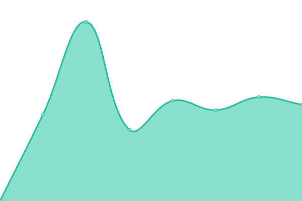
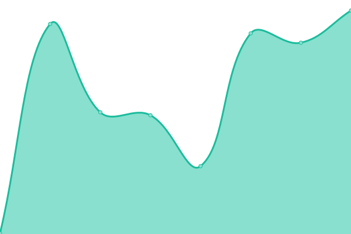
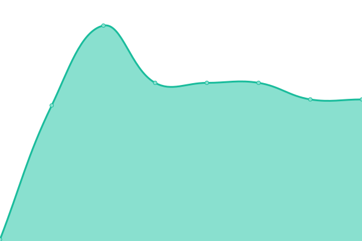
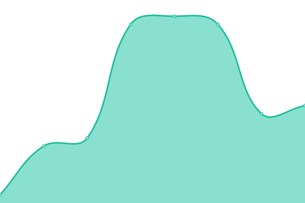

# [📈 Live Status/Status ao vivo](https://updates.linkwaveconnect.com.br): <!--live status--> **🟧 Partial outage**

This repository contains the open-source uptime monitor and status page for [LinkWave Connect](https://git.linkwaveconnect.com.br/linkwaveconnect), powered by [Upptime](https://github.com/upptime/upptime).

With [Upptime](https://upptime.js.org), you can get your own unlimited and free uptime monitor and status page, powered entirely by a GitHub repository. We use [Issues](https://github.com/linkwaveconnect/uptime/issues) as incident reports, [Actions](https://github.com/linkwaveconnect/uptime/actions) as uptime monitors, and [Pages](https://updates.linkwaveconnect.com.br) for the status page.

## [📈 Live Status](https://demo.upptime.js.org): <!--live status--> **🟧 Partial outage**

<!--start: status pages-->
<!-- This summary is generated by Upptime (https://github.com/upptime/upptime) -->
<!-- Do not edit this manually, your changes will be overwritten -->
<!-- prettier-ignore -->
| URL | Status | History | Response Time | Uptime |
| --- | ------ | ------- | ------------- | ------ |
|  [LinkWave Connect](https://linkwaveconnect.com.br) | Offline | [link-wave-connect.yml](https://github.com/linkwaveconnect/uptime/commits/HEAD/history/link-wave-connect.yml) | 

 2317ms
     
 | 

<a href="https://updates.linkwaveconnect.com.br/history/link-wave-connect">98.98%</a>
    

|  [LinkWave Portal / Accounts](https://web.linkwaveconnect.com.br) | Offline | [link-wave-portal-accounts.yml](https://github.com/linkwaveconnect/uptime/commits/HEAD/history/link-wave-portal-accounts.yml) | 

 3309ms
     
 | 

<a href="https://updates.linkwaveconnect.com.br/history/link-wave-portal-accounts">99.01%</a>
    

|  [LinkWave Search](https://search.linkwaveconnect.com.br) | Offline | [link-wave-search.yml](https://github.com/linkwaveconnect/uptime/commits/HEAD/history/link-wave-search.yml) | 

 0ms
     
 | 

<a href="https://updates.linkwaveconnect.com.br/history/link-wave-search">0.00%</a>
    

|  [GitWave](https://git.linkwaveconnect.com.br) | Offline | [git-wave.yml](https://github.com/linkwaveconnect/uptime/commits/HEAD/history/git-wave.yml) | 

 531ms
     
 | 

<a href="https://updates.linkwaveconnect.com.br/history/git-wave">99.03%</a>
    

|  [LinkBin](https://bin.linkwaveconnect.com.br) | Offline | [link-bin.yml](https://github.com/linkwaveconnect/uptime/commits/HEAD/history/link-bin.yml) | 

 471ms
     
 | 

<a href="https://updates.linkwaveconnect.com.br/history/link-bin">99.08%</a>
    

|  [KanWave](https://kan.linkwaveconnect.com.br) | Offline | [kan-wave.yml](https://github.com/linkwaveconnect/uptime/commits/HEAD/history/kan-wave.yml) | 

 655ms
     
 | 

<a href="https://updates.linkwaveconnect.com.br/history/kan-wave">99.06%</a>
    

|  [LinkWave Status](https://status.linkwaveconnect.com.br) | Online | [link-wave-status.yml](https://github.com/linkwaveconnect/uptime/commits/HEAD/history/link-wave-status.yml) | 

 254ms
     
 | 

<a href="https://updates.linkwaveconnect.com.br/history/link-wave-status">100.00%</a>
    

|  [LinkWave Updates (This site / Este site)](https://updates.linkwaveconnect.com.br) | Online | [link-wave-updates-this-site-este-site.yml](https://github.com/linkwaveconnect/uptime/commits/HEAD/history/link-wave-updates-this-site-este-site.yml) | 

 235ms
     
 | 

<a href="https://updates.linkwaveconnect.com.br/history/link-wave-updates-this-site-este-site">100.00%</a>
    

|  Nameserver 1 | Online | [nameserver-1.yml](https://github.com/linkwaveconnect/uptime/commits/HEAD/history/nameserver-1.yml) | 

 32ms
     
 | 

<a href="https://updates.linkwaveconnect.com.br/history/nameserver-1">100.00%</a>
    

|  Nameserver 2 | Online | [nameserver-2.yml](https://github.com/linkwaveconnect/uptime/commits/HEAD/history/nameserver-2.yml) | 

 20ms
     
 | 

<a href="https://updates.linkwaveconnect.com.br/history/nameserver-2">100.00%</a>
    

|  Open Source Hosting Server | Offline | [open-source-hosting-server.yml](https://github.com/linkwaveconnect/uptime/commits/HEAD/history/open-source-hosting-server.yml) | 

 1083ms
     
 | 

<a href="https://updates.linkwaveconnect.com.br/history/open-source-hosting-server">99.08%</a>
    

<!--end: status pages-->

[**Visit our status website →**](https://updates.linkwaveconnect.com.br)

## 📄 License

- Powered by: [Upptime](https://github.com/upptime/upptime)
- Code: [MIT](./LICENSE) © [Anand Chowdhary](https://anandchowdhary.com), supported by [Pabio](https://pabio.com)
- Data in the `./history` directory: [Open Database License](https://opendatacommons.org/licenses/odbl/1-0/)
